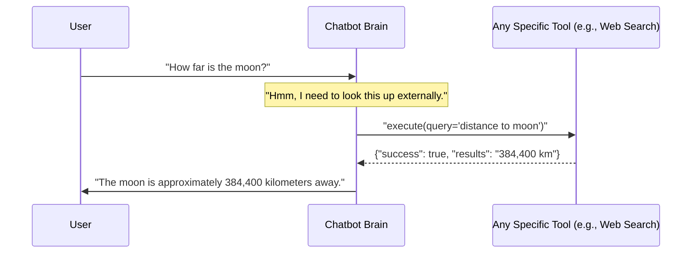

# Chapter 1: Tools (External Capabilities)

Imagine you're chatting with a super-smart friend. They know a lot, but sometimes, even they need to look things up, check a document, or ask someone else for specific information. Our chatbots are very similar! While they have a lot of built-in "knowledge" from their training, they can't know *everything* about the real world, current events, or your specific company documents.

So, how do our chatbots get answers to questions like:
*   "What's the current weather in Paris?"
*   "Where can I find the 'Employee Handbook' in our company documents?"
*   "Show me the sales figures for last month from our database."

This is where **Tools** come in!

### What are Tools?

Think of **Tools** as specialized assistants that our chatbot can "call upon" to do specific jobs outside of its own "brain" or core knowledge. Each tool is designed to interact with an *external system* to perform one particular task.

It's like having a team of experts:

*   **Web Search Tool:** Your "Internet Surfer" – knows how to search the web for current events, general knowledge, or public information. It doesn't *know* the answer, but it knows *how* to find it online.
*   **Document Search Tool:** Your "Librarian" – knows how to search through your company's internal documents, like PDFs, reports, or manuals, to find specific information.
*   **MongoDB/SQL Query Tool:** Your "Database Analyst" – knows how to ask questions directly to your company's databases (like a customer list or product inventory) to pull out specific data.

The important thing is: **the chatbot doesn't know *how* to perform these tasks itself.** It just knows *which* tool to ask and what information to give that tool. The tool then does the hard work and gives the answer back to the chatbot.

### Using Tools: A Day in the Life of a Chatbot

Let's see how our chatbot might use these tools:

#### Use Case: Getting Current Information
If you ask the chatbot: "What are the latest developments in AI research?"

1.  The chatbot's "brain" realizes this is a very recent topic, something it probably doesn't have in its training data.
2.  It identifies that this kind of question needs external, up-to-date information.
3.  The chatbot decides to use the **Web Search Tool**.
4.  It tells the Web Search Tool: "Please search for 'latest developments in AI research'."
5.  The Web Search Tool goes to the internet, performs the search, and brings back relevant articles and summaries.
6.  The Web Search Tool gives these results back to the chatbot.
7.  The chatbot then uses these results to formulate a helpful answer for you!

This process happens very quickly behind the scenes.

#### Example Inputs and Outputs (Conceptual)

Let's imagine the chatbot deciding to use a tool:

```python
# The chatbot decides to use the Web Search Tool
tool_to_use = "WebSearchTool"
query_for_tool = "current weather in Paris"

# (Behind the scenes, the tool is called)
# Imagine this is the tool's response:
web_search_result = {
    "success": True,
    "results": [
        {"title": "Paris Weather", "content": "Currently sunny, 25°C, light breeze."},
        # ... other search results
    ]
}

print(web_search_result["results"][0]["content"])
# Output: Currently sunny, 25°C, light breeze.
```
When you ask for "current weather in Paris", the chatbot *gives* the search query to the `WebSearchTool`. The tool then *returns* the weather information, which the chatbot uses to reply to you.

### Inside a Tool: The Common Blueprint (`BaseTool`)

Every tool in our system follows a common blueprint, a set of rules and capabilities that all tools must have. This blueprint is defined by something called `BaseTool`. It's like saying every specialized assistant (Web Searcher, Librarian, Database Analyst) must have a name, know how to set themselves up, and know how to do their main job.

Let's look at the simplified blueprint:

```python
# File: atlas-q-a-rag/app/tools/base.py

from abc import ABC, abstractmethod
from typing import Any, Dict

class BaseTool(ABC):
    """Base class for all tools in the Agentic RAG system."""

    def __init__(self, config: Dict[str, Any]):
        self.config = config
        self.name = self.__class__.__name__
        self.initialize() # Setup the tool when it's created

    def initialize(self) -> None:
        """Override this to perform tool-specific setup."""
        pass

    @abstractmethod
    async def execute(self, query: str, **kwargs) -> Dict[str, Any]:
        """
        Execute the tool with the given query.
        All tools MUST implement this method.
        """
        pass

    @classmethod
    def get_tool_description(cls) -> str:
        """Get a description of what this tool does."""
        return cls.__doc__ or "No description available"
```

*   **`BaseTool(ABC)`:** This tells us it's a "blueprint" (an Abstract Base Class, `ABC`). You can't directly create a `BaseTool`; you must create a *specific* tool (like `WebSearchTool`) that follows this blueprint.
*   **`__init__(self, config)`:** This is how a tool gets set up. It receives `config` (settings, like an API key for web search) and sets its `name`. It then calls `initialize()`.
*   **`initialize(self) -> None`:** This is where each specific tool does its own special setup, like connecting to a database or setting up an external service client.
*   **`@abstractmethod async def execute(self, query: str, **kwargs) -> Dict[str, Any]:`**: This is the most important part! It means *every tool MUST have an `execute` method*. This is the method the chatbot calls to tell the tool to do its job. It takes a `query` (what to search for, or what question to ask) and returns a `Dictionary` (a structured result) with the tool's findings. The `async` means it can run in the background without blocking other operations.
*   **`get_tool_description(cls) -> str`**: This provides a short text description of what the tool does. This is useful for the chatbot to understand when to use a tool.

### A Concrete Example: The Web Search Tool

Now let's see how a real tool, the `WebSearchTool`, builds upon this `BaseTool` blueprint.

```python
# File: atlas-q-a-rag/app/tools/web_search.py

import os
from typing import Any, Dict
from tavily import TavilyClient # An external library for web searching
from app.tools.base import BaseTool # Our base blueprint

class WebSearchTool(BaseTool):
    """Tool for searching the web using TavilySearch API."""

    def initialize(self) -> None:
        # Get the API key from settings or environment variables
        self.api_key = self.config.get("api_key", os.getenv("TAVILY_API_KEY"))
        if self.api_key:
            # Connect to the external web search service
            self.client = TavilyClient(api_key=self.api_key)
        else:
            self.client = None # No client if no API key

    async def execute(self, query: str, **kwargs) -> Dict[str, Any]:
        if not self.client:
            return {"success": False, "error": "Client not initialized"}

        try:
            # Perform the actual web search using the external service
            response = self.client.search(query=query)

            # Extract just the relevant search results
            results = response.get("results", [])

            return {"success": True, "query": query, "results": results}
        except Exception as e:
            return {"success": False, "error": str(e), "results": []}

    @classmethod
    def get_tool_description(cls) -> str:
        return "Searches the web for information using the TavilySearch API."
```
1.  **`class WebSearchTool(BaseTool):`**: This line shows that `WebSearchTool` "inherits" from `BaseTool`. It means `WebSearchTool` *is a* `BaseTool` and must follow its rules.
2.  **`initialize(self) -> None`**: This method sets up the connection to the `TavilyClient`, which is the actual service that performs web searches. It makes sure we have an API key to use this service.
3.  **`async def execute(self, query: str, **kwargs) -> Dict[str, Any]:`**: This is where the magic happens! When the chatbot needs to search the web, it calls `web_search_tool.execute("your search query")`. This method then uses the `self.client` (our connection to Tavily) to perform the search and returns the `results`.

### Other Specialized Tools

Our `atlas-q-a-rag` project also includes other specialized tools, all built using the same `BaseTool` blueprint:

*   **`DocumentSearchTool`** ([`app/tools/document_search.py`](atlas-q-a-rag/app/tools/document_search.py)): This tool specializes in searching through your private documents (like PDFs or text files) that have been processed and stored in a special database called a "vector store". When you ask "Find the policy on remote work," this tool jumps into action.
*   **`MongoDBQueryTool`** ([`app/tools/mongodb_query.py`](atlas-q-a-rag/app/tools/mongodb_query.py)): For querying MongoDB databases. It's smart enough to even use a Language Model (LLM) to convert your natural language question (e.g., "Show me users named Alice") into a technical MongoDB query that the database understands.
*   **`SQLQueryTool`** ([`app/tools/sql_query.py`](atlas-q-a-rag/app/tools/sql_query.py)): Similar to the MongoDB tool, but for traditional SQL databases (like PostgreSQL, MySQL, SQL Server). It also uses an LLM to turn your human language into precise SQL commands.

Each of these tools is a separate, independent "expert" ready to be called upon by the chatbot when needed.

### How a Chatbot "Calls" a Tool (Simplified Flow)

Let's visualize the simple interaction between a user, the chatbot's brain, and a tool:



In this diagram:
1.  The **User** asks a question.
2.  The **Chatbot Brain** (which we'll explore more in [LangGraph Agent (Chatbot Brain)](03_langgraph_agent__chatbot_brain__.md)) receives the question.
3.  The Chatbot Brain decides which **Specific Tool** is best suited for the job.
4.  It then "calls" that tool's `execute` method with the necessary information (the `query`).
5.  The **Specific Tool** performs its action (e.g., searches the web).
6.  The tool returns its `results` to the **Chatbot Brain**.
7.  Finally, the **Chatbot Brain** uses these results to generate a response for the **User**.

### Conclusion

Tools are the chatbot's gateway to the outside world. They allow our `atlas-q-a-rag` system to go beyond its internal knowledge and fetch up-to-date information, access private documents, and query databases. By providing a clear `BaseTool` blueprint, we ensure that new capabilities can be easily added and integrated into the system.

But how does the chatbot *know* which tools it has, and how does it decide which one to use? That's where **Bot Configuration** comes in!

[Next Chapter: Bot Configuration (BotConfig)](02_bot_configuration__botconfig__.md)

---

Generated by [AI Codebase Knowledge Builder](https://github.com/The-Pocket/Tutorial-Codebase-Knowledge)