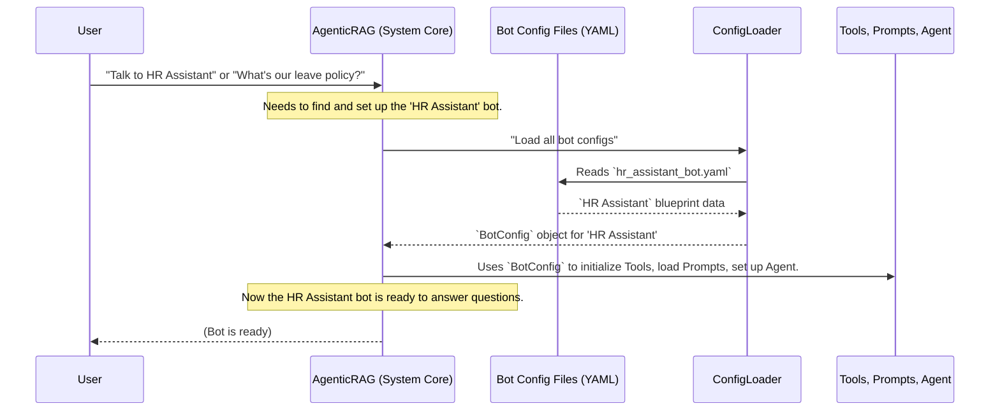

# Chapter 2: Bot Configuration (BotConfig)

In our first chapter, we explored how **[Tools (External Capabilities)](01_tools__external_capabilities__.md)** give our chatbots the power to reach out and fetch information from the outside world – like searching the web or checking internal documents. But imagine you have a toolbox full of amazing gadgets. How do you decide *which* gadget to use for *which* job? And how do you know if you're building a robot chef or a robot mechanic?

This is where **Bot Configuration (BotConfig)** comes in!

### What is a BotConfig?

Think of a `BotConfig` as the **master blueprint or detailed personality profile for each individual chatbot** in our system. Just like a chef has a recipe and a mechanic has a repair manual, each chatbot needs a complete guide that tells it:

*   **Its Name:** What do we call this bot? ("HR Assistant," "Sales Q&A Bot," etc.)
*   **Its Purpose:** What is this bot supposed to do? (Answer HR questions, provide sales figures, etc.)
*   **Its Gadgets (Tools):** Which specific tools (like the `WebSearchTool` or `DocumentSearchTool` we learned about) does *this particular bot* have access to?
*   **Its Voice (Prompts):** How should it talk? What instructions should it follow to act like a helpful assistant?
*   **Its Status:** Is it fully active and helping users, or is it still in testing?

Without this blueprint, a bot wouldn't know what it is, what its job is, or what it's capable of. The `atlas-q&a-rag` system reads these blueprints to know exactly how to set up and run each unique chatbot.

### Why Do We Need BotConfig?

Imagine you want to create two different chatbots:

1.  A **"Company Policy Bot"** that *only* answers questions about internal HR documents. It doesn't need to search the web or query databases.
2.  A **"Product Information Bot"** that needs to search the web for competitor info AND query your product database.

Without `BotConfig`, you'd have to write completely separate code for each bot, which would be messy and hard to manage. `BotConfig` solves this by allowing us to:

*   **Define Unique Bots:** Give each bot its own identity and purpose.
*   **Customize Capabilities:** Specify exactly which tools each bot can use.
*   **Control Behavior:** Tell the bot how to respond using specific prompts.
*   **Manage Easily:** Store all these details in simple, readable files.

### A BotConfig in Action: Our HR Assistant

Let's imagine we want to create a friendly **"HR Assistant"** chatbot. Its main job is to answer questions about company policies. This means it needs access to our internal documents.

Here's how we might define its blueprint using a `BotConfig` file (these are usually YAML files, which are easy to read):

```yaml
# File: configs/hr_assistant_bot.yaml (simplified)

name: HR Assistant
description: "A friendly bot that answers questions about company HR policies."
isactive: 0 # 0 means production-ready (not in test mode)

prompts:
  system_prompt_path: "hr_system_prompt.txt" # This file tells the bot how to behave
  query_prompt_path: "hr_query_prompt.txt"   # This file helps the bot understand questions

tools:
  - type: DocumentSearchTool # This bot needs to search documents
    enabled: true
    config:
      # Specific settings for the DocumentSearchTool would go here
      # For example, which document index to search.
      pass
```

Let's break down this simple `BotConfig` for our "HR Assistant":

*   **`name: HR Assistant`**: This is the unique name of our bot.
*   **`description: "A friendly bot..."`**: A brief explanation of what this bot does.
*   **`isactive: 0`**: This tells the system that this bot is ready for general use (0 for production, 1 for testing, 2 for inactive).
*   **`prompts:`**: This section points to external files that contain the text instructions for our bot.
    *   **`system_prompt_path: "hr_system_prompt.txt"`**: Imagine this file contains text like "You are a helpful HR assistant. Always be polite and refer to official company documents for answers."
    *   **`query_prompt_path: "hr_query_prompt.txt"`**: This might contain instructions on how the bot should process incoming questions.
*   **`tools:`**: This is a list of all the tools our "HR Assistant" can use.
    *   **`- type: DocumentSearchTool`**: It specifies that this bot has access to the `DocumentSearchTool` (which we learned about in [Chapter 1: Tools (External Capabilities)](01_tools__external_capabilities__.md)).
    *   **`enabled: true`**: This tool is turned on for this bot.
    *   **`config: {}`**: Any specific settings needed for the `DocumentSearchTool` (like where to find the HR documents) would go here.

With this small YAML file, we've given our system a complete definition for a new, specialized chatbot!

### How the System Uses BotConfig (Under the Hood)

So, how does the `atlas-q-a-rag` system actually *read* this blueprint and bring our "HR Assistant" to life?

Let's look at the simplified flow:



1.  **User Request:** When a user interacts with the system (e.g., asking to chat with "HR Assistant" or sending a query), the central **`AgenticRAG`** class (which is the core of our system) kicks into action.
2.  **Loading Configurations:** The `AgenticRAG` system relies on a helper called `ConfigLoader`. This `ConfigLoader` scans a special folder (like `configs/`) for all the `.yaml` files that define our bots.
3.  **Parsing Blueprints:** For each YAML file (like `hr_assistant_bot.yaml`), the `ConfigLoader` reads it and turns the information into a structured object called `BotConfig`. This `BotConfig` object is like a digital representation of our blueprint.
4.  **Bot Assembly:** The `AgenticRAG` system then takes this `BotConfig` object and uses it to "assemble" the chatbot. It looks at the `tools` section to create and set up the correct [Tools (External Capabilities)](01_tools__external_capabilities__.md), it uses the `prompts` section to load the bot's "voice" instructions, and it sets up the "brain" of the bot (which we'll cover in [LangGraph Agent (Chatbot Brain)](03_langgraph_agent__chatbot_brain__.md)).
5.  **Ready to Go:** Once assembled, the bot is ready to process user queries, knowing exactly what it is and what it can do!

### Inside the Code: The `BotConfig` Model

The blueprint itself is defined in our Python code as a `Pydantic BaseModel`. This helps ensure that every `BotConfig` file follows a clear structure and contains all the necessary information.

Here’s a simplified look at the `BotConfig` definition:

```python
# File: atlas-q-a-rag/app/models/bot_config.py

from typing import Dict, List, Optional, Any
from pydantic import BaseModel, Field

class ToolConfig(BaseModel):
    # Blueprint for *one* tool within the bot
    type: str = Field(..., description="The type of tool")
    enabled: bool = Field(True, description="Is this tool active?")
    config: Dict[str, Any] = Field(default_factory=dict, description="Tool settings")

class PromptConfig(BaseModel):
    # Blueprint for prompt paths
    system_prompt_path: str = Field(..., description="Path to system prompt")
    query_prompt_path: str = Field(..., description="Path to query prompt")

class AgentConfig(BaseModel):
    # Blueprint for the bot's 'brain' settings
    type: str = Field("langgraph", description="Agent type")
    model: str = Field("gpt-4", description="LLM model for agent")
    config: Dict[str, Any] = Field(default_factory=dict, description="Agent settings")

class BotConfig(BaseModel):
    """Configuration for a bot (the master blueprint)."""
    name: str = Field(..., description="The name of the bot")
    description: str = Field("", description="A description of the bot")
    isactive: int = Field(0, description="Bot status: 0=production, 1=test, 2=inactive")
    tools: List[ToolConfig] = Field(default_factory=list, description="Tools for bot")
    prompts: PromptConfig = Field(..., description="Prompt configuration")
    agent: AgentConfig = Field(default_factory=AgentConfig, description="Agent config")
    # ... other optional settings like database, rate_limit, metadata
```

*   **`BotConfig(BaseModel)`**: This tells us `BotConfig` is a structured data container.
*   **`name: str = Field(...)`**: Defines the `name` field, which must be a string. `Field(...)` adds a description and marks it as required.
*   **`tools: List[ToolConfig]`**: This is a very important part! It means the `tools` section of our `BotConfig` YAML will be a *list* of `ToolConfig` objects. Each `ToolConfig` specifies one tool, including its `type` (like "DocumentSearchTool") and `enabled` status.
*   **`prompts: PromptConfig`**: This points to another smaller blueprint, `PromptConfig`, which holds the paths to the prompt files.
*   **`agent: AgentConfig`**: This links to the `AgentConfig` blueprint, which contains settings for the bot's "brain" (which we'll discuss in the next chapter).

### The `ConfigLoader` at Work

The `ConfigLoader` is responsible for finding and parsing these `BotConfig` YAML files.

```python
# File: atlas-q-a-rag/app/core/config_loader.py (simplified)

import yaml
from pathlib import Path
from typing import Dict, Optional
from app.models.bot_config import BotConfig

class ConfigLoader:
    def __init__(self, config_dir: str = "configs"):
        self.config_dir = config_dir
        self.configs: Dict[str, BotConfig] = {}
        self._load_configs() # Load all configs when the loader starts

    def _load_configs(self) -> None:
        config_path = Path(self.config_dir)
        for file_path in config_path.glob("*.yaml"): # Find all .yaml files
            try:
                with open(file_path, "r") as f:
                    config_data = yaml.safe_load(f) # Read YAML content

                bot_config = BotConfig(**config_data) # Convert to BotConfig object
                self.configs[bot_config.name] = bot_config # Store by bot name
                # ... logging ...
            except Exception as e:
                # ... error handling ...

    def get_config(self, bot_name: str) -> Optional[BotConfig]:
        return self.configs.get(bot_name)

    def get_all_configs(self) -> Dict[str, BotConfig]:
        return self.configs
```

*   **`_load_configs()`**: This method is called when `ConfigLoader` is created. It iterates through all `.yaml` files in the `configs` directory.
*   **`yaml.safe_load(f)`**: This line uses a library (`PyYAML`) to read the text content of the YAML file and turn it into a Python dictionary.
*   **`BotConfig(**config_data)`**: This is the magic part! It takes the dictionary loaded from the YAML file and "pours" it into our `BotConfig` object. If the YAML file doesn't match the `BotConfig` blueprint (e.g., a missing required field), it will raise an error, helping us keep our configurations correct.

### The `AgenticRAG` System Using the Blueprint

Finally, the main `AgenticRAG` class uses the loaded `BotConfig` objects to set up everything for each bot.

```python
# File: atlas-q-a-rag/app/core/agentic_rag.py (simplified)

from app.models.bot_config import BotConfig
from app.core.config_loader import ConfigLoader
from app.tools.base import BaseTool # The base for all tools
from app.tools.web_search import WebSearchTool
# ... other tool imports ...
from app.agents.langgraph_agent import LangGraphAgent

class AgenticRAG:
    # ... __init__ and other methods ...

    def _load_bots(self) -> None:
        """Load all bot configurations and initialize tools, prompts, agent."""
        bot_configs = self.config_loader.get_all_configs() # Get all BotConfig objects

        for bot_name, bot_config in bot_configs.items():
            # ... logging ...
            # 1. Initialize tools based on BotConfig.tools
            tools = self._initialize_tools(bot_config)

            # 2. Load prompts based on BotConfig.prompts
            system_prompt = self._load_prompt(bot_config.prompts.system_prompt_path)
            query_prompt = self._load_prompt(bot_config.prompts.query_prompt_path)

            # 3. Initialize the agent (chatbot brain) based on BotConfig.agent
            agent = LangGraphAgent(bot_config.agent, system_prompt, query_prompt)

            # Store all components for this bot
            self.bots[bot_name] = {
                "config": bot_config,
                "tools": tools,
                "agent": agent,
                # ... other components like query_router ...
            }
            # ... logging ...

    def _initialize_tools(self, bot_config: BotConfig) -> Dict[str, BaseTool]:
        """Initialize tools for a bot based on its BotConfig."""
        tools = {}
        for tool_config in bot_config.tools: # Loop through each ToolConfig in the blueprint
            if not tool_config.enabled:
                continue

            tool_class = self.TOOL_CLASSES.get(tool_config.type) # Find the correct Tool class
            if tool_class:
                tool = tool_class(tool_config.config) # Create the tool, passing its settings
                tools[tool_config.type] = tool
                # ... logging ...
        return tools

    # ... _load_prompt and other methods ...
```

*   **`_load_bots()`**: This method is the orchestrator. It gets all `BotConfig` blueprints from the `ConfigLoader`.
*   **`for bot_name, bot_config in bot_configs.items():`**: It loops through each `BotConfig` object.
*   **`tools = self._initialize_tools(bot_config)`**: It calls a helper method `_initialize_tools` (shown next) to create all the specific [Tools (External Capabilities)](01_tools__external_capabilities__.md) that this bot is allowed to use, as defined in its `BotConfig`.
*   **`system_prompt = self._load_prompt(...)`**: It reads the prompt files specified in the `BotConfig` to load the bot's "personality" instructions.
*   **`agent = LangGraphAgent(...)`**: It creates the bot's "brain" (`LangGraphAgent`), giving it the specific settings from `bot_config.agent` and the loaded prompts.
*   **`self.bots[bot_name] = {...}`**: Finally, it stores all these assembled parts (config, tools, agent) together under the bot's `name`, making it ready to receive queries!

### Conclusion

`BotConfig` is the cornerstone of making `atlas-q-a-rag` flexible and powerful. By defining each chatbot's purpose, available tools, and communication style in simple, external configuration files, we can easily create, customize, and manage many different specialized bots without changing the core code. It’s like having a factory that can build many types of robots, each from its own unique blueprint!

Now that our bot has a defined personality and set of tools, how does it actually *think* and decide what to do? That's what we'll explore in the next chapter: the **LangGraph Agent**, the true "brain" of our chatbot.

[Next Chapter: LangGraph Agent (Chatbot Brain)](03_langgraph_agent__chatbot_brain__.md)

---

Generated by [AI Codebase Knowledge Builder](https://github.com/The-Pocket/Tutorial-Codebase-Knowledge)