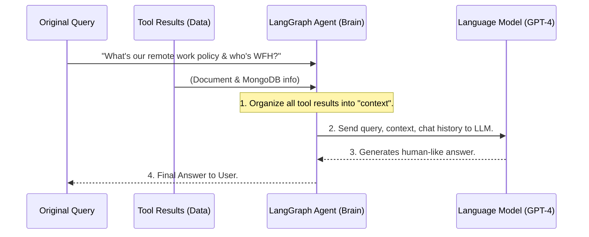

# Chapter 3: LangGraph Agent (Chatbot Brain)

In our first chapter, we explored how **[Tools (External Capabilities)](01_tools__external_capabilities__.md)** give our chatbots the power to reach out and fetch information from the outside world – like searching the web or checking internal documents. Chapter 2, **[Bot Configuration (BotConfig)](02_bot_configuration__botconfig__.md)**, showed us how to give each bot a "personality" and define *which* tools it has access to. But a bot with tools and a personality still needs a "brain" to *think* and decide *how* to use those tools to answer your questions.

### What is the LangGraph Agent (Chatbot Brain)?

Imagine you ask your HR Assistant bot (which we configured in Chapter 2) a complex question: "What is the policy on remote work, and can I see who is currently working remotely?"

This single question requires several "thought" steps from the bot:

1.  **Understanding:** The bot needs to understand that you're asking about "remote work policy" and "who is working remotely."
2.  **Information Gathering (via Tools):** It needs to realize that "remote work policy" is in a document, and "who is working remotely" might be in a database. It then needs to use its **[Tools (External Capabilities)](01_tools__external_capabilities__.md)** (like `DocumentSearchTool` and `MongoDBQueryTool`) to find this information.
3.  **Synthesizing (Formulating Answer):** Once it gets raw data back from the tools, it can't just dump that data on you. It needs to combine all the pieces of information (the policy text, the list of remote workers) and write a clear, helpful, human-like answer.
4.  **Remembering (Chat History):** If you ask a follow-up question, it should remember the previous conversation to provide a smooth chat experience.

This entire "thinking," "orchestrating," and "responding" process is handled by the **LangGraph Agent**. It's the actual "brain" of our chatbot, built using a special framework called **LangGraph**. Think of LangGraph as a "flowchart builder" for AI programs. It allows us to define a sequence of steps (like "retrieve context," "generate response") and how they connect, making the chatbot's "thought process" structured and clear.

### The Flow of Thought: A Simple Chatbot Brain Process

Let's simplify how our LangGraph Agent processes a query *after* the **[Query Router](05_query_router_.md)** (which we'll cover later) has already decided which tools to use and run them. For now, assume the LangGraph Agent receives the original question and the *results* from any tools that were run.

Here's the basic "thought process" of the LangGraph Agent:



In this simplified diagram:
1.  The LangGraph Agent receives your original question and the data gathered by the **[Tools (External Capabilities)](01_tools__external_capabilities__.md)** (e.g., policy text, list of names).
2.  It organizes all this data into a clear "context."
3.  It then sends *everything* – your original question, the organized context, and any past chat history (managed by the **[Memory Manager](06_memory_manager_.md)**, which is part of the agent) – to a powerful Large Language Model (LLM) like GPT-4.
4.  The LLM acts like a brilliant writer, using all the provided information to craft a comprehensive and polite answer.
5.  The LangGraph Agent then gives this final answer back to you.

### Key Components of the LangGraph Agent

The LangGraph Agent combines a few crucial elements to form the chatbot's brain:

1.  **Agent State (`AgentState`)**: This is like the agent's temporary "scratchpad" or "working memory." It holds all the information the agent needs at any moment: the user's `query`, raw `tool_results`, neatly organized `context`, the `chat_history`, and the final `response`.
2.  **Language Model (LLM)**: This is the actual "language" part of the brain, typically a powerful model like OpenAI's GPT-4. It's what understands human language and generates human-like text.
3.  **Nodes (Thought Steps)**: These are the individual "steps" or "thoughts" in the LangGraph "flowchart." Each node performs a specific task. Our simple agent has two main nodes:
    *   `retrieve_context`: Gathers and organizes information from `tool_results`.
    *   `generate_response`: Uses the LLM to write the final answer based on the query and context.
4.  **Edges (Flow of Thought)**: These define how the "nodes" connect, showing the sequence of operations. For instance, after `retrieve_context`, the agent moves to `generate_response`.
5.  **Memory Manager**: This component (which we'll cover in [Chapter 6: Memory Manager](06_memory_manager_.md)) allows the agent to remember past conversations, providing continuity. It's initialized within the LangGraph Agent.

### How the LangGraph Agent is Set Up

The LangGraph Agent is initialized by the central **[AgenticRAG System Core](04_agenticrag_system_core_.md)** using the settings from the **[Bot Configuration (BotConfig)](02_bot_configuration__botconfig__.md)**.

Let's look at the basic structure of the `LangGraphAgent` class:

```python
# File: atlas-q-a-rag/app/agents/langgraph_agent.py

import logging
from typing import Dict, List, Optional, Any, TypedDict
from langchain_openai import ChatOpenAI
from langgraph.graph import StateGraph, END # Core LangGraph components
from app.models.bot_config import AgentConfig # Settings for this agent
from app.core.memory_manager import MemoryManager # For chat history

# The Agent's Scratchpad/Working Memory
class AgentState(TypedDict):
    query: str
    context: List[Dict[str, Any]]
    tool_results: Dict[str, Any]
    response: Optional[str]
    error: Optional[str]
    chat_history: Optional[str]

class LangGraphAgent:
    def __init__(
        self, agent_config: AgentConfig, system_prompt: str, query_prompt: str
    ):
        self.agent_config = agent_config
        self.system_prompt = system_prompt # Bot's overall personality
        self.query_prompt = query_prompt   # How bot should process queries

        # Initialize the LLM (e.g., GPT-4) using settings from BotConfig
        self.llm = ChatOpenAI(model=agent_config.model, temperature=0.0)

        # Initialize memory manager to handle chat history
        self.memory_manager = MemoryManager()

        # Build the "flowchart" of the agent's thoughts
        self.graph = self._build_graph()
```
*   **`AgentState(TypedDict)`**: This defines the `AgentState` or "scratchpad" we talked about. It's a structured way to hold all the inputs and outputs as the agent "thinks" through a problem.
*   **`__init__`**: When a `LangGraphAgent` is created, it receives its specific settings (`agent_config`) from the **[Bot Configuration (BotConfig)](02_bot_configuration__botconfig__.md)**. It also gets the `system_prompt` and `query_prompt`, which are the bot's "voice" and instructions, also loaded based on the **[Bot Configuration (BotConfig)](02_bot_configuration__botconfig__.md)**.
*   **`self.llm = ChatOpenAI(...)`**: This line connects to the powerful Language Model (LLM) that will do the actual text understanding and generation.
*   **`self.memory_manager = MemoryManager()`**: This sets up the component that will keep track of the conversation history for this specific bot.
*   **`self.graph = self._build_graph()`**: This is a very important part! It calls a method to set up the "flowchart" (`StateGraph`) that defines the agent's logic.

### Building the Agent's Flowchart (`_build_graph`)

This method defines the individual "thought steps" and how they connect to form a logical flow.

```python
# File: atlas-q-a-rag/app/agents/langgraph_agent.py (simplified)

class LangGraphAgent:
    # ... __init__ and other methods ...

    def _build_graph(self) -> StateGraph:
        # Define the individual "thought steps" (nodes) as functions
        def retrieve_context(state: AgentState) -> AgentState:
            # Code to extract and format context from tool_results
            # Example: Combine document text, MongoDB items, etc.
            collected_context_list = [] # Imagine this is filled with tool results
            return {**state, "context": collected_context_list}

        def generate_response(state: AgentState) -> AgentState:
            # Code to prepare prompts using query, context, chat history
            # Then call self.llm.invoke() to get the response
            generated_text = self.llm.invoke("...") # Simplified
            return {**state, "response": generated_text, "error": None}

        # Create the graph (our flowchart) using the AgentState
        graph = StateGraph(AgentState)

        # Add the "thought steps" as named nodes
        graph.add_node("retrieve_context", retrieve_context)
        graph.add_node("generate_response", generate_response)

        # Define how the steps connect (edges)
        graph.add_edge("retrieve_context", "generate_response") # From context to response
        graph.add_edge("generate_response", END) # After response, the process ends

        # Set where the thinking process starts when a new query comes
        graph.set_entry_point("retrieve_context")

        return graph.compile() # Prepare the graph to run efficiently
```

*   **`retrieve_context(state: AgentState)`**: This is the first "thought step." Its job is to take the raw results from various **[Tools (External Capabilities)](01_tools__external_capabilities__.md)** (which are stored in `state["tool_results"]`) and organize them into a clean, readable `context` list. For example, it might turn a list of database records into a readable table format. It then updates the `state` (the agent's scratchpad) with this new `context`.
*   **`generate_response(state: AgentState)`**: This is the second "thought step." It uses the user's `query`, the newly formatted `context`, and the `chat_history` to build a complete message for the LLM. It then calls the `self.llm.invoke()` method to get a human-like response and updates the `state` with this `response`.
*   **`graph = StateGraph(AgentState)`**: This line creates the actual "flowchart" object, telling it that it will use our `AgentState` as its common data scratchpad throughout the process.
*   **`graph.add_node(...)`**: This adds our `retrieve_context` and `generate_response` functions as named "nodes" (steps) in the flowchart.
*   **`graph.add_edge(...)`**: This defines the flow. `retrieve_context` clearly leads to `generate_response`.
*   **`graph.add_edge("generate_response", END)`**: This special `END` node marks the successful completion of the thought process.
*   **`graph.set_entry_point("retrieve_context")`**: This tells LangGraph where the thought process should begin when a new query comes in.

This setup means that whenever the agent needs to answer a question, it will *always* first `retrieve_context` and then `generate_response`.

### Processing a Query with the Agent (`process_query`)

Finally, when the **[AgenticRAG System Core](04_agenticrag_system_core_.md)** has finished routing the query and running tools, it passes the results to the LangGraph Agent's `process_query` method.

```python
# File: atlas-q-a-rag/app/agents/langgraph_agent.py (simplified)

class LangGraphAgent:
    # ... __init__, _build_graph, and other methods ...

    async def process_query(
        self, query: str, tool_results: Dict[str, Any], session_id: Optional[str] = None
    ) -> Dict[str, Any]:
        # 1. Get chat history from MemoryManager if a session ID is provided
        chat_history = None
        if session_id:
            chat_history = self.memory_manager.get_chat_history_str(session_id)
            # Example: "Human: Hello\nAI: Hi there!\n"

        # 2. Set up the initial "scratchpad" for the agent's thinking
        initial_state: AgentState = {
            "query": query,
            "context": [], # This will be filled by the 'retrieve_context' step
            "tool_results": tool_results,
            "response": None,
            "error": None,
            "chat_history": chat_history,
        }

        # 3. Run the entire LangGraph "flowchart"
        # This will execute 'retrieve_context' then 'generate_response'
        result = await self.graph.ainvoke(initial_state)

        # 4. Save conversation to memory after getting response
        if session_id:
            self.memory_manager.add_user_message(session_id, query)
            self.memory_manager.add_ai_message(session_id, result["response"])

        return {
            "query": query,
            "response": result["response"],
            "error": result["error"],
        }
```
*   **`process_query(...)`**: This is the public method that the main `AgenticRAG` system calls. It receives the user's `query`, the `tool_results` (the information gathered by **[Tools (External Capabilities)](01_tools__external_capabilities__.md)**), and an optional `session_id` for chat history.
*   **`chat_history = self.memory_manager.get_chat_history_str(session_id)`**: If a `session_id` is provided, it fetches the previous conversation from the **[Memory Manager](06_memory_manager_.md)** to include it in the LLM's context. This helps the bot remember what was said before.
*   **`initial_state: AgentState = {...}`**: It creates the starting `AgentState` (the scratchpad) with the `query` and `tool_results`. Notice `context` starts empty, as it's designed to be filled by the `retrieve_context` node during the process.
*   **`result = await self.graph.ainvoke(initial_state)`**: This is the magical line that kicks off the entire LangGraph flowchart. It tells the agent to "think" using the defined steps, starting with `initial_state`. It waits until the `END` node is reached and returns the final state (which will now contain the `response`).
*   **`self.memory_manager.add_user_message(...)` and `self.memory_manager.add_ai_message(...)`**: After the agent has processed the query and generated a response, these lines save the current user query and the bot's response to the conversation `memory` for future interactions within the same `session_id`.

This entire `process_query` method is how our HR Assistant bot, when given your query and the results from document search and database queries, processes them to generate a polite and comprehensive answer about remote work policies and who is working remotely.

### Conclusion

The **LangGraph Agent** is truly the "brain" that brings our chatbots to life. It takes all the raw ingredients – your question, historical conversation, and data from **[Tools (External Capabilities)](01_tools__external_capabilities__.md)** – and orchestrates a structured thought process to synthesize a coherent, helpful, human-like response. By using LangGraph, we can define clear, step-by-step reasoning flows, making our chatbots capable of tackling complex, multi-step questions.

Now that we understand the brain, the tools, and the configuration, how do all these pieces fit together to form the complete `atlas-q-a-rag` system? That's what we'll explore in the next chapter: the **AgenticRAG System Core**.

[Next Chapter: AgenticRAG System Core](04_agenticrag_system_core_.md)

---

Generated by [AI Codebase Knowledge Builder](https://github.com/The-Pocket/Tutorial-Codebase-Knowledge)