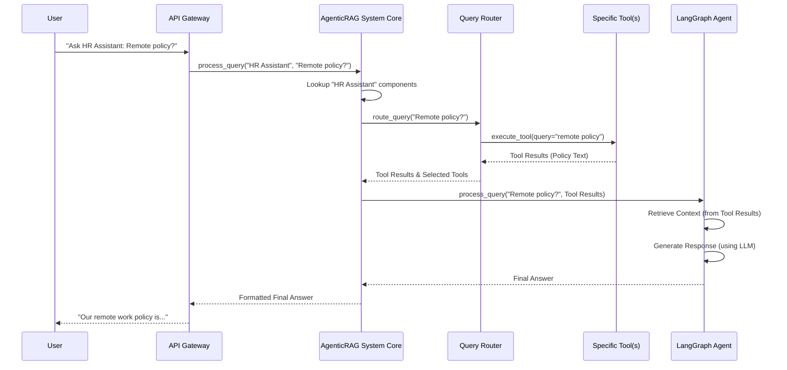

# Chapter 4: AgenticRAG System Core

In our journey so far, we've learned about the individual building blocks of our `atlas-q-a-rag` system:
*   **[Tools (External Capabilities)](01_tools__external_capabilities__.md)**: These are the specialized assistants (like web search or document search) that our chatbots can call upon to get information from the outside world.
*   **[Bot Configuration (BotConfig)](02_bot_configuration__botconfig__.md)**: This acts as the unique blueprint or personality profile for each chatbot, defining its purpose and which tools it has access to.
*   **[LangGraph Agent (Chatbot Brain)](03_langgraph_agent__chatbot_brain__.md)**: This is the actual "brain" of a specific chatbot, responsible for understanding your question, using the collected information, and generating a coherent answer.

But imagine you have all these amazing individual components – a skilled chef, a detailed recipe, and a full set of cooking tools. Who decides *which* recipe to make, gathers all the ingredients, hands the right tools to the chef at the right time, and serves the final meal?

This is precisely the job of the **AgenticRAG System Core**!

### What is the AgenticRAG System Core?

The **AgenticRAG System Core** is the **central hub** and **orchestrator** of our entire RAG (Retrieval-Augmented Generation) application. Think of it as the **project manager** for all our chatbots. It's the first place user requests arrive, and it’s responsible for making sure all the different parts of the system work together smoothly, from start to finish.

Its main responsibilities include:

*   **Loading All Chatbots:** When the system starts, the `AgenticRAG System Core` scans for all available chatbot blueprints ([BotConfig](02_bot_configuration__botconfig__.md) files) and sets up each chatbot with its specific tools and brain.
*   **Main Entry Point:** Every user question first comes to the `AgenticRAG System Core`.
*   **Orchestration:** For each question, it identifies the correct chatbot, decides which tools need to be used ([Query Router](05_query_router_.md)), ensures those tools run, and then hands over the gathered information to the chatbot's brain ([LangGraph Agent](03_langgraph_agent__chatbot_brain__.md)) to generate the final answer.

Without the `AgenticRAG System Core`, our tools and chatbot brains would just be individual pieces of a puzzle, unable to work together as a coherent system. It brings everything to life!

### A Day in the Life of the System Core

Let's use our "HR Assistant" bot from [Chapter 2: Bot Configuration (BotConfig)](02_bot_configuration__botconfig__.md) as an example.

Imagine you send a message to the system saying: "Hi, I need to talk to the HR Assistant, and what's the company's remote work policy?"

Here’s how the `AgenticRAG System Core` would handle this:

1.  **Request Arrives:** Your message first hits the `AgenticRAG System Core`.
2.  **Identify Bot:** It sees you want to talk to the "HR Assistant." It already has the "HR Assistant" chatbot fully loaded and ready to go (thanks to the [BotConfig](02_bot_configuration__botconfig__.md) it read at startup).
3.  **Route Query:** It sends your question to the "HR Assistant" bot's internal [Query Router](05_query_router_.md). The router decides that to answer "remote work policy," it needs to use the `DocumentSearchTool`.
4.  **Execute Tools:** The `AgenticRAG System Core` makes sure the `DocumentSearchTool` runs and retrieves the policy document.
5.  **Process with Brain:** It takes the original question and the retrieved policy document and hands them over to the "HR Assistant" bot's [LangGraph Agent (Chatbot Brain)](03_langgraph_agent__chatbot_brain__.md).
6.  **Generate Response:** The `LangGraph Agent` processes the information and creates a friendly answer about the remote work policy.
7.  **Send Back:** The `AgenticRAG System Core` takes this answer and sends it back to you.

This entire process is managed by the `AgenticRAG System Core`, making it seem like one seamless interaction.

### How the System Core is Set Up (Under the Hood)

Let's look at how the `AgenticRAG System Core` is initialized and how it orchestrates the process.

First, when our application (using FastAPI) starts, it calls a special function to set up all the necessary global components, including our `AgenticRAG System Core`.

#### 1. Application Startup and Dependency Initialization

The main entry point for our API is in `app_factory.py`. When the API starts, it calls `initialize_dependencies()`:

```python
# File: atlas-q-a-rag/app/api/app_factory.py (simplified)

from fastapi import FastAPI
from app.api.dependencies import initialize_dependencies

def create_app() -> FastAPI:
    """Create and configure the FastAPI application."""
    
    # This function sets up our core system components!
    initialize_dependencies() 
    
    app = FastAPI(
        title="Agentic RAG API",
        # ... other FastAPI settings ...
    )

    # ... middleware and routers ...

    return app
```
**Explanation:** This `create_app` function is what launches our entire web service. The `initialize_dependencies()` line is crucial because it's where our `AgenticRAG System Core` gets created and prepared for action.

Next, let's see what `initialize_dependencies()` does:

```python
# File: atlas-q-a-rag/app/api/dependencies.py (simplified)

from app.core.agentic_rag import AgenticRAG # Import our core class

# Global instances (will hold our AgenticRAG object)
_agentic_rag: AgenticRAG = None 

def initialize_dependencies():
    """Initialize global dependencies."""
    global _agentic_rag # We need to modify the global variable
    
    print("Initializing AgenticRAG system...")
    # Here, we create the one and only AgenticRAG System Core instance!
    _agentic_rag = AgenticRAG() 
    print("AgenticRAG system initialized successfully")

# Function to get the initialized instance (used by API routes)
def get_agentic_rag() -> AgenticRAG:
    return _agentic_rag
```
**Explanation:** This code snippet shows how the `AgenticRAG` class is turned into a live object (`_agentic_rag`). This `_agentic_rag` object is then used by other parts of the system whenever they need to process a query or interact with a bot.

#### 2. The AgenticRAG System Core's Own Initialization

When the `AgenticRAG()` object is created, its `__init__` method runs. This is where it prepares itself to be the central hub.

```python
# File: atlas-q-a-rag/app/core/agentic_rag.py (simplified)

from app.core.config_loader import ConfigLoader # For reading bot blueprints

class AgenticRAG:
    def __init__(self, config_dir: str = "configs", prompts_dir: str = "prompts"):
        print("Initializing AgenticRAG system...")

        self.config_dir = config_dir
        self.prompts_dir = prompts_dir
        self.bots: Dict[str, Dict[str, Any]] = {} # This will store all loaded bots

        # 1. Initialize the ConfigLoader to read bot blueprints
        self.config_loader = ConfigLoader(config_dir)

        # 2. Load all bot configurations and set up their components
        self._load_bots() 

        print(f"AgenticRAG system initialized with {len(self.bots)} bots")
```
**Explanation:** When `AgenticRAG` starts, it immediately prepares two important things:
1.  **`ConfigLoader`**: This is its assistant for finding and reading all the [Bot Configuration (BotConfig)](02_bot_configuration__botconfig__.md) files (our blueprints).
2.  **`_load_bots()`**: This crucial method is then called to actually go through each blueprint and assemble all the chatbots!

#### 3. Assembling All the Chatbots (`_load_bots`)

This is where the `AgenticRAG System Core` acts as a factory, building each chatbot according to its blueprint.

```python
# File: atlas-q-a-rag/app/core/agentic_rag.py (simplified)

from app.models.bot_config import BotConfig # Our bot blueprint model
from app.tools.base import BaseTool         # Base for all tools
from app.agents.langgraph_agent import LangGraphAgent # Our chatbot brain
from app.core.query_router import QueryRouter # The query decision-maker

class AgenticRAG:
    # ... __init__ and other methods ...

    def _load_bots(self) -> None:
        """Load all bot configurations and initialize tools, prompts, agent, router."""
        print("Loading bot configurations...")
        bot_configs = self.config_loader.get_all_configs() # Get all blueprints

        for bot_name, bot_config in bot_configs.items():
            print(f"Loading bot: {bot_name}")

            # 1. Initialize tools for this bot (from Chapter 1)
            tools = self._initialize_tools(bot_config) 

            # 2. Load prompts for this bot (its personality instructions)
            system_prompt = self._load_prompt(bot_config.prompts.system_prompt_path)
            query_prompt = self._load_prompt(bot_config.prompts.query_prompt_path)

            # 3. Initialize the Query Router for this bot (Chapter 5)
            query_router = QueryRouter(bot_config, tools)

            # 4. Initialize the LangGraph Agent (chatbot brain) for this bot (Chapter 3)
            agent = LangGraphAgent(bot_config.agent, system_prompt, query_prompt)

            # Store all components for this specific bot, ready for use!
            self.bots[bot_name] = {
                "config": bot_config,
                "tools": tools,
                "query_router": query_router,
                "agent": agent,
            }
            print(f"Successfully loaded bot: {bot_name}")
```
**Explanation:** This `_load_bots` method is where the real assembly happens. It loops through every `BotConfig` blueprint it found:
1.  It calls helper methods (`_initialize_tools`, `_load_prompt`) to set up the **[Tools (External Capabilities)](01_tools__external_capabilities__.md)** and load the bot's "voice" for this specific bot.
2.  It creates a **[Query Router](05_query_router_.md)** (which we'll discuss next) to help this bot decide which tools to use.
3.  It then creates the **[LangGraph Agent (Chatbot Brain)](03_langgraph_agent__chatbot_brain__.md)** for this bot, giving it its specific settings and prompts.
4.  Finally, it neatly stores *all* these prepared components (config, tools, router, agent) in a dictionary called `self.bots`, indexed by the bot's name. Now, any part of the system can quickly access a fully prepared chatbot by its name!

#### 4. Processing a User Query

Once all bots are loaded, the `AgenticRAG System Core` is ready to process incoming questions. This is its main job during runtime.

```python
# File: atlas-q-a-rag/app/core/agentic_rag.py (simplified)

from app.models.api_models import QueryRequest, QueryResponse # Data models for requests/responses

class AgenticRAG:
    # ... __init__, _load_bots, and other methods ...

    async def process_query(self, bot_name: str, request: QueryRequest) -> QueryResponse:
        """Process a query for a specific bot."""
        print(f"Processing query for bot: {bot_name}")

        bot = self.get_bot(bot_name) # Get the loaded bot's components
        if not bot:
            raise ValueError(f"Bot not found: {bot_name}")

        # 1. Use the bot's Query Router to decide which tools to run
        query_router: QueryRouter = bot["query_router"]
        tool_results = await query_router.route_query(
            request.query, **request.metadata or {}
        )
        print(f"Tools selected: {tool_results.get('selected_tools')}")

        # 2. Pass the query and tool results to the bot's LangGraph Agent (brain)
        agent: LangGraphAgent = bot["agent"]
        agent_response = await agent.process_query(
            request.query,
            tool_results["tool_responses"], # The data returned by the tools
            session_id=request.session_id,
        )

        # 3. Format and return the final response
        response = QueryResponse(
            bot_name=bot_name,
            query=request.query,
            response=agent_response["response"], # The answer from the chatbot brain
            tool_responses=[], # Simplified: actual results would be here
            selected_tools=tool_results.get("selected_tools"),
            # ... other metadata ...
        )
        print(f"Query processed successfully for bot: {bot_name}")
        return response
```
**Explanation:** This `process_query` method is the heart of how user questions are handled:
1.  It first retrieves all the components (tools, router, agent) for the specified `bot_name` from its `self.bots` dictionary.
2.  It then calls the `route_query` method on that bot's **[Query Router](05_query_router_.md)**. This is where the system decides *which* tools are needed and runs them to gather information.
3.  After the tools have finished, it takes the original `query` and the `tool_responses` (the data gathered by the tools) and passes them to that bot's **[LangGraph Agent (Chatbot Brain)](03_langgraph_agent__chatbot_brain__.md)**'s `process_query` method.
4.  The `LangGraph Agent` does its "thinking" and generates the final human-like `response`.
5.  Finally, the `AgenticRAG System Core` packages this response along with other details (like which tools were used) and sends it back to the user.

This entire flow, from receiving the query to sending the final answer, is orchestrated by the `AgenticRAG System Core`.

### The Complete Flow

Here's a simplified sequence of how everything works together when a user asks a question, coordinated by the `AgenticRAG System Core`:



### Conclusion

The **AgenticRAG System Core** is the foundational piece that makes our entire `atlas-q-a-rag` project a cohesive and powerful application. It's the grand conductor, responsible for initializing all the chatbots and their capabilities, and then orchestrating every step of the query processing from the moment a user asks a question until they receive an answer. It binds the [Tools (External Capabilities)](01_tools__external_capabilities__.md), [Bot Configurations (BotConfig)](02_bot_configuration__botconfig__.md), and [LangGraph Agents (Chatbot Brains)](03_langgraph_agent__chatbot_brain__.md) together into a smoothly operating system.

Now that we understand the central hub, let's dive deeper into the very first "thinking" step that happens *inside* the `AgenticRAG System Core` when a query arrives: how it decides which tools to use. This is the job of the **Query Router**.

[Next Chapter: Query Router](05_query_router_.md)

---

Generated by [AI Codebase Knowledge Builder](https://github.com/The-Pocket/Tutorial-Codebase-Knowledge)