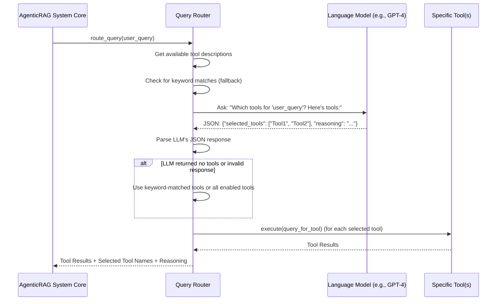

# Chapter 5: Query Router

In our previous chapter, we saw how the **[AgenticRAG System Core](04_agenticrag_system_core_.md)** acts as the central orchestrator, bringing together all the components of our chatbot. It loads our chatbots based on their **[Bot Configuration (BotConfig)](02_bot_configuration__botconfig__.md)**, which tells it *which* [Tools (External Capabilities)](01_tools__external_capabilities__.md) a bot has access to and how its [LangGraph Agent (Chatbot Brain)](03_langgraph_agent__chatbot_brain__.md) should work.

Now, imagine this: You're at a very busy office, and a new client walks in with a question. This question could be for the "research department" (web search), the "legal department" (document search), or the "finance department" (database query). Who directs the client to the *right* department?

This is exactly the job of the **Query Router**!

### What is the Query Router?

The **Query Router** acts as a **smart dispatcher**, or a **"tool manager,"** for each chatbot. When you ask a question, the Query Router's job is to figure out which of the available "tools" (like web search or document search) would be most useful to answer your specific question.

Think of it as the chatbot's **first "thinking" step** when it receives a new query. Before the chatbot's main brain ([LangGraph Agent (Chatbot Brain)](03_langgraph_agent__chatbot_brain__.md)) even starts to formulate an answer, the Query Router steps in and asks:

*   "Does this question need external information?"
*   "If so, which of my available tools can best provide it?"

It uses an AI model (a Large Language Model - LLM) to analyze your query and decide. It then sends your query to the selected tools, collects their findings, and *then* the chatbot's brain formulates its final response.

### Why Do We Need a Query Router?

Without a Query Router, the chatbot wouldn't know if "What's the weather?" needs a web search or if "What's our vacation policy?" needs a document search. It would either try to use *all* tools (which is slow and expensive!) or fail to use the right one.

The Query Router makes our chatbots:

*   **Efficient:** Only uses the necessary tools.
*   **Smart:** Understands the intent of the query to pick the best tool.
*   **Cost-Effective:** Avoids unnecessary calls to external services.
*   **Safe:** Can be instructed to avoid certain tools for sensitive information (e.g., don't use web search for financial data).

### Use Case: Asking a Complex Question

Let's use a concrete example. Imagine you ask the system:

"**What's the current weather in London, and where can I find information about our company's security policies?**"

This single question needs two different types of information:
1.  **Current Weather:** This typically requires up-to-date information from the internet (using a `WebSearchTool`).
2.  **Security Policies:** This is likely internal company information (using a `DocumentSearchTool`).

Here’s how the **Query Router** handles this:

1.  **Receives Query:** The Query Router for the selected bot receives your question.
2.  **Analyzes with AI:** It uses its internal LLM (a mini-brain just for tool selection!) to read your question and the descriptions of all the tools the bot has.
3.  **Decides:** The LLM "thinks" and realizes:
    *   "Current weather" points to `WebSearchTool`.
    *   "Company's security policies" points to `DocumentSearchTool`.
    *   It might also consider if the question can be answered *without* any tools (e.g., "Hello!").
4.  **Selects Tools:** It identifies `WebSearchTool` and `DocumentSearchTool` as the most appropriate.
5.  **Orchestrates Execution:** It then instructs the **[AgenticRAG System Core](04_agenticrag_system_core_.md)** to run both `WebSearchTool` (for London weather) and `DocumentSearchTool` (for security policies).
6.  **Collects Results:** After the tools run, it collects all the information they found.
7.  **Passes to Brain:** Finally, it hands over your original question and *all* the collected information (weather, policy text) to the chatbot's main brain ([LangGraph Agent (Chatbot Brain)](03_langgraph_agent__chatbot_brain__.md)) to craft the final answer for you.

This intelligent selection process is what makes our `atlas-q-a-rag` system so powerful and flexible.

### How the Query Router Works (Under the Hood)

Let's look at the steps the `QueryRouter` takes and the code that makes it happen.

#### The Flow of Tool Selection



1.  The **[AgenticRAG System Core](04_agenticrag_system_core_.md)** calls the `QueryRouter`'s `route_query` method with your question.
2.  The `QueryRouter` first prepares a list of all available tools and their descriptions (like "WebSearchTool: Searches the web for information"). It also checks for simple keyword matches in your query (e.g., if "weather" is in the query, it might suggest `WebSearchTool`).
3.  It then crafts a special instruction (a "prompt") for its internal LLM. This prompt tells the LLM: "Here's a user's question, and here are the tools I have. Tell me which tools to use in JSON format, and why."
4.  The LLM "thinks" and returns a response, ideally in the specified JSON format, with the names of the tools it recommends and its reasoning.
5.  The `QueryRouter` parses this JSON response.
6.  **Important Fallback:** If the LLM doesn't return a valid JSON, or if it doesn't recommend any tools, the `QueryRouter` has a backup plan: it will either use the tools it identified through simple keyword matching, or if no keywords matched, it will use *all* enabled tools for that bot (though this is less common with a well-trained LLM). This ensures the system doesn't break even if the LLM makes a mistake.
7.  Finally, the `QueryRouter` orchestrates the *actual execution* of the selected tools and collects their results before returning everything back to the `AgenticRAG System Core`.

#### The `QueryRouter` Class

The `QueryRouter` is initialized within the **[AgenticRAG System Core](04_agenticrag_system_core_.md)** when a bot is loaded, as defined by its **[Bot Configuration (BotConfig)](02_bot_configuration__botconfig__.md)**.

Here's a simplified look at its structure:

```python
# File: atlas-q-a-rag/app/core/query_router.py

import logging
import json
from typing import Dict, List, Any, Optional, Tuple
from langchain_openai import ChatOpenAI # Our LLM for decision making
from langchain_core.messages import SystemMessage, HumanMessage

from app.tools.base import BaseTool # The base for all tools
from app.models.bot_config import BotConfig # Our bot's blueprint

class QueryRouter:
    def __init__(self, bot_config: BotConfig, tools: Dict[str, BaseTool]):
        """
        Initialize the query router.
        """
        self.bot_config = bot_config
        self.tools = tools # The tools available to *this specific bot*

        # Initialize the LLM specifically for tool selection decisions
        self.llm = ChatOpenAI(model=bot_config.agent.model, temperature=0.0)
        # temperature=0.0 means the LLM will be very "deterministic" and less creative
```
*   **`__init__(self, bot_config, tools)`**: When a `QueryRouter` is created for a specific bot, it receives that bot's `bot_config` (its blueprint) and a dictionary of all the [Tools (External Capabilities)](01_tools__external_capabilities__.md) it has access to.
*   **`self.llm = ChatOpenAI(...)`**: This is where the Query Router gets its own mini-brain – a Language Model (LLM). This LLM is *only* used for the task of deciding which tools to use, not for generating the final user-facing response. Setting `temperature=0.0` makes the LLM less "creative" and more reliable for decision-making.

#### Getting Tool Descriptions (`_get_tool_descriptions`)

Before the LLM can decide which tools to use, it needs to know what tools are available and what they do.

```python
# File: atlas-q-a-rag/app/core/query_router.py

class QueryRouter:
    # ... __init__ and other methods ...

    def _get_tool_descriptions(self) -> Dict[str, Dict[str, Any]]:
        """
        Get descriptions of available tools.
        """
        tool_descriptions = {}

        for tool_config in self.bot_config.tools: # Loop through tools defined in bot's config
            if tool_config.enabled and tool_config.type in self.tools:
                tool = self.tools[tool_config.type]
                tool_descriptions[tool_config.type] = {
                    "description": tool.get_tool_description(), # Get the description from the tool itself
                    "config": tool_config.config,
                }
        return tool_descriptions
```
*   This method iterates through the `tools` defined in the bot's `BotConfig` (e.g., `WebSearchTool`, `DocumentSearchTool`).
*   For each enabled tool, it calls `tool.get_tool_description()` (a method defined in `BaseTool` from [Chapter 1: Tools (External Capabilities)](01_tools__external_capabilities__.md)) to get a human-readable summary of what the tool does.
*   This description is crucial for the LLM to make an informed decision.

#### Crafting the Prompt for the LLM (`_get_tool_selection_prompt`)

This is where the instructions for the LLM are created. It's like giving a very specific set of rules to our "dispatcher" LLM.

```python
# File: atlas-q-a-rag/app/core/query_router.py

class QueryRouter:
    # ... methods ...

    def _get_tool_selection_prompt(
        self, query: str, tool_descriptions: Dict[str, Dict[str, Any]]
    ) -> List[Dict[str, str]]:
        """
        Create the prompt for tool selection.
        """
        tool_desc_str = ""
        for tool_name, info in tool_descriptions.items():
            tool_desc_str += f"- {tool_name}: {info['description']}\n"

        system_message = """
You are an AI assistant that decides which tools to use to answer a user's query.
You will be given a user query and a list of available tools with their descriptions.
Your task is to select the most appropriate tools to use to answer the query.

Follow these guidelines:
1. Only select tools that are directly relevant to answering the query.
2. You can select multiple tools if needed.
3. You can select no tools if you believe the query can be answered without any tools.
   - For simple greetings, casual conversation, or questions that don't require external data, return an empty list [].
4. Respond in JSON format with a list of tool names and a brief explanation for each selection.

SENSITIVE INFORMATION RESTRICTIONS:
- NEVER use WebSearchTool for queries about fees, tuition, payments, scholarships, financial aid, or any financial matters.
- For financial/sensitive queries, use only internal tools (DocumentSearchTool, SQLQueryTool, MongoDBQueryTool).
- If no internal tools can answer financial queries, return empty tool list.
"""
        user_message = f"""
User Query: {query}

Available Tools:
{tool_desc_str}

Select the most appropriate tools to answer this query.
"""
        return [
            SystemMessage(content=system_message),
            HumanMessage(content=user_message),
        ]
```
*   This code builds a `system_message` that acts as the LLM's "rules of engagement." It explicitly tells the LLM its role, how to behave, and even includes crucial **sensitive information restrictions** (e.g., "NEVER use WebSearchTool for financial matters").
*   It also constructs a `user_message` that contains the actual `query` from the user and the `tool_desc_str` (the list of tools and their descriptions generated by `_get_tool_descriptions`).
*   The LLM will receive these instructions and use them to decide which tools are appropriate.

#### Selecting Tools with the LLM (`_select_tools_with_reasoning`)

This is the central method that puts everything together to get the LLM's recommendation.

```python
# File: atlas-q-a-rag/app/core/query_router.py

class QueryRouter:
    # ... methods ...

    async def _select_tools_with_reasoning(self, query: str) -> Dict[str, Any]:
        """
        Select which tools to use for a query using an LLM and return the reasoning.
        """
        tool_descriptions = self._get_tool_descriptions()

        if not tool_descriptions:
            return {"selected_tools": [], "reasoning": "No tools available."}

        # Get keyword-based tool selection (as a fallback)
        keyword_selected_tools = self._get_keyword_selected_tools(query)

        try:
            messages = self._get_tool_selection_prompt(query, tool_descriptions)
            response = await self.llm.ainvoke(messages) # Call the LLM!
            response_text = response.content.strip()

            # Parse the LLM response (expecting JSON)
            return self._parse_llm_response(response_text, keyword_selected_tools)

        except Exception as e:
            # If LLM call fails, fall back to keyword selection
            logger.error(f"Error selecting tools with LLM: {str(e)}")
            selected_tools = self._get_fallback_tools(keyword_selected_tools)
            return {
                "selected_tools": selected_tools,
                "reasoning": f"LLM error: {str(e)}. Using fallback selection.",
                "raw_llm_output": {"error": f"Exception: {str(e)}"},
            }
```
*   It first gathers the `tool_descriptions`.
*   It also runs a `_get_keyword_selected_tools` check. This is a simpler, rule-based approach that quickly identifies tools if certain keywords are present in the query (e.g., "weather" -> `WebSearchTool`). This is important as a *fallback* if the LLM fails or doesn't give a clear answer.
*   Then, `await self.llm.ainvoke(messages)` makes the actual call to the Language Model (LLM). This is where the LLM reads the user's query, the available tools, and the instructions, and returns its decision.
*   The raw text response from the LLM is then passed to `_parse_llm_response` to extract the structured information (tool names, reasoning).
*   Crucially, there's a `try-except` block: if anything goes wrong with the LLM call or its response, the system `falls back` to the `keyword_selected_tools` or other default options, ensuring robustness.

#### Parsing the LLM's JSON Response (`_parse_llm_response`)

The LLM is asked to respond in JSON, but sometimes it doesn't format it perfectly. This method handles extracting the JSON and dealing with errors.

```python
# File: atlas-q-a-rag/app/core/query_router.py

class QueryRouter:
    # ... methods ...

    def _parse_llm_response(
        self, response_text: str, keyword_selected_tools: List[str]
    ) -> Dict[str, Any]:
        """
        Parse the LLM response and extract tool selection information.
        """
        # Tries to find JSON in the LLM's text output
        json_str, _ = self._extract_json_from_response(response_text)

        if not json_str: # If no JSON could be extracted
            # Fallback if LLM didn't return proper JSON
            selected_tools = self._get_fallback_tools(keyword_selected_tools)
            return {
                "selected_tools": selected_tools,
                "reasoning": "Could not extract JSON from LLM response, using fallback.",
            }

        try:
            result = json.loads(json_str) # Convert JSON string to Python dictionary
            selected_tools = result.get("selected_tools", [])
            reasoning = result.get("reasoning", "No reasoning provided")

            # Filter out any tools that don't actually exist or aren't enabled for this bot
            selected_tools = [t for t in selected_tools if t in self.tools]

            if not selected_tools: # If LLM recommended no valid tools, or an empty list
                selected_tools = self._get_fallback_tools(keyword_selected_tools)
                reasoning = "LLM explicitly or implicitly selected no tools, using fallback."

            return {"selected_tools": selected_tools, "reasoning": reasoning}

        except json.JSONDecodeError as e:
            # If the extracted text wasn't valid JSON, fallback
            selected_tools = self._get_fallback_tools(keyword_selected_tools)
            return {
                "selected_tools": selected_tools,
                "reasoning": f"JSON parse error: {str(e)}. Using fallback selection.",
            }
```
*   **`_extract_json_from_response`**: This helper (not shown in detail, but similar to the `try-except` logic) attempts to pull out a JSON string from the LLM's raw text response. LLMs sometimes wrap JSON in code blocks (```json ... ```) or mix it with other text.
*   **`json.loads(json_str)`**: If a JSON string is found, this line converts it into a Python dictionary.
*   **Fallback Logic:** If JSON extraction or parsing fails, or if the LLM explicitly returns an empty list, the system falls back to the simpler, keyword-based tool selection (`_get_fallback_tools`) to ensure *something* happens. This robust error handling is key to a reliable system.

#### The Main Orchestration (`route_query`)

This is the public method that the **[AgenticRAG System Core](04_agenticrag_system_core_.md)** calls to start the routing process.

```python
# File: atlas-q-a-rag/app/core/query_router.py

class QueryRouter:
    # ... methods ...

    async def route_query(self, query: str, **kwargs) -> Dict[str, Any]:
        """
        Route a query to the appropriate tools.
        """
        # 1. Use the LLM to determine which tools to use
        tool_selection_result = await self._select_tools_with_reasoning(query)
        tools_to_use = tool_selection_result["selected_tools"]
        reasoning = tool_selection_result.get("reasoning", "No reasoning provided")

        # 2. Execute each tool that was selected
        tool_responses = await self._execute_tools(tools_to_use, query, **kwargs)

        return {
            "query": query,
            "tool_responses": tool_responses, # The actual data from tools
            "selected_tools": tools_to_use,   # Names of tools that ran
            "tool_selection_reasoning": reasoning, # Why those tools were picked
            # ... other metadata like raw_llm_output ...
        }
```
*   **`_select_tools_with_reasoning(query)`**: This is the first step, where the LLM (with its fallbacks) makes the decision on *which* tools to use.
*   **`_execute_tools(tools_to_use, query, **kwargs)`**: After the `QueryRouter` has decided which tools are best, it then calls this method. This method iterates through the `tools_to_use` list and calls the `execute` method on each specific [Tool (External Capabilities)](01_tools__external_capabilities__.md) (like `web_search_tool.execute("London weather")`). It collects all their responses.
*   Finally, it packages all this information – the original query, the data returned by the tools, the names of the tools that were used, and the LLM's reasoning for choosing them – into a single dictionary and returns it to the **[AgenticRAG System Core](04_agenticrag_system_core_.md)**. This information is then passed on to the [LangGraph Agent (Chatbot Brain)](03_langgraph_agent__chatbot_brain__.md) to formulate the final answer.

### Conclusion

The **Query Router** is a vital component that injects intelligence right at the beginning of the query processing pipeline. By leveraging a specialized LLM, it intelligently decides which external capabilities ([Tools (External Capabilities)](01_tools__external_capabilities__.md)) are needed for a given user query. This ensures our chatbots are efficient, accurate, and can handle complex requests that require multiple types of information. It acts as the intelligent "traffic controller" for our bot's external data gathering.

Now that we understand how the system decides which information to retrieve, what about remembering past conversations? That's where the **Memory Manager** comes in!

[Next Chapter: Memory Manager](06_memory_manager_.md)

---

Generated by [AI Codebase Knowledge Builder](https://github.com/The-Pocket/Tutorial-Codebase-Knowledge)