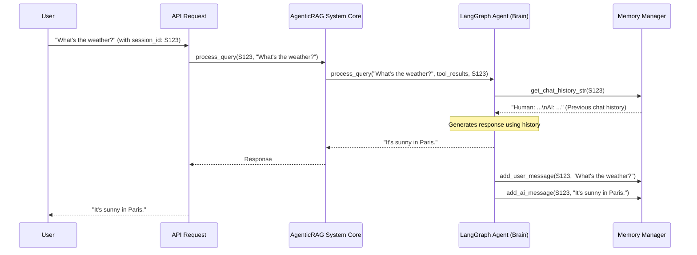

# Chapter 6: Memory Manager

In our journey so far, we've explored how our chatbot gets its capabilities through **[Tools (External Capabilities)](01_tools__external_capabilities__.md)**, how each chatbot is given a unique blueprint via **[Bot Configuration (BotConfig)](02_bot_configuration__botconfig__.md)**, how its "brain" ([LangGraph Agent (Chatbot Brain)](03_langgraph_agent__chatbot_brain__.md)) processes information, and how the **[Query Router](05_query_router_.md)** intelligently picks the right tools.

But imagine you're talking to a friend. If you ask them a question, and then a follow-up question, they remember what you just talked about. They don't just forget everything after each sentence! Our chatbots need to do the same to make conversations feel natural and continuous.

This is where the **Memory Manager** comes in!

### What is the Memory Manager?

The **Memory Manager** acts as the chatbot's **short-term memory**. Just like you remember what you just talked about, this component stores the ongoing conversation history (your questions and the bot's previous answers) for each user session.

Think of it like this:

*   Each time you start a chat, the `Memory Manager` opens a new, empty **notebook** just for your conversation.
*   When you ask a question, it writes your question in that notebook.
*   When the bot replies, it writes the bot's answer in the same notebook.
*   If you then ask a follow-up question, the bot can quickly glance at its notebook to remember everything you've both said so far, understanding the context of your new question.

This is crucial because it allows the chatbot to understand context and refer back to earlier parts of your conversation, making the interaction feel more natural and continuous.

#### Why do we need a Memory Manager?

Without a `Memory Manager`, every single question you ask would be treated as if it's the very first question. The chatbot would have no idea about previous turns in the conversation.

**Imagine this frustrating chat:**

**You:** "What's the capital of France?"
**Bot:** "The capital of France is Paris."
**You:** "And what's its population?"
**Bot:** "I'm sorry, I don't understand. What population are you asking about?"

This happens because the bot forgot you were just talking about Paris! The `Memory Manager` prevents this by giving the bot that essential "remembering" capability.

### How the Memory Manager Works

The `Memory Manager` keeps separate "notebooks" for different users or different chat sessions. It identifies these notebooks using a unique `session_id` (a special code given to each chat).

Let's trace how the `Memory Manager` is used during a conversation:



**Step-by-step Explanation:**

1.  **User Asks:** The `User` sends a question to the system, along with a `session_id` (e.g., `S123`) that identifies their current conversation.
2.  **Core Receives:** The **[AgenticRAG System Core](04_agenticrag_system_core_.md)** receives the query and forwards it to the correct chatbot's **[LangGraph Agent (Chatbot Brain)](03_langgraph_agent__chatbot_brain__.md)**.
3.  **Brain Asks for History:** The `LangGraph Agent` (before generating a response) asks the `Memory Manager` for the `chat_history` associated with `session_id: S123`.
4.  **Memory Provides History:** The `Memory Manager` looks up `S123` in its stored "notebooks" and provides the previous conversation turns (e.g., "Human: Hello\nAI: Hi there!").
5.  **Brain Generates Response:** The `LangGraph Agent` then uses your current question, any information it gathered from **[Tools (External Capabilities)](01_tools__external_capabilities__.md)**, *and* the chat history to formulate a coherent answer.
6.  **Memory Updates:** *After* the `LangGraph Agent` sends its response back to you, it tells the `Memory Manager` to add *both* your current question and its own answer to the `S123` notebook. This prepares the memory for the next turn.

### Key Components of the Memory Manager

The `Memory Manager` utilizes an existing powerful library called `LangChain` to handle the actual storage and retrieval of conversation turns. Specifically, it uses `LangChain`'s `ConversationBufferMemory`, which is designed for this exact purpose.

Let's look at the `MemoryManager` class in `app/core/memory_manager.py`.

```python
# File: atlas-q-a-rag/app/core/memory_manager.py

import logging
from typing import Dict, List
from langchain_core.messages import AIMessage, HumanMessage, BaseMessage
from langchain.memory import ConversationBufferMemory # Our core memory tool

logger = logging.getLogger(__name__)

class MemoryManager:
    """
    Memory manager for the Agentic RAG system.
    Provides ephemeral conversation memory using Langchain's ConversationBufferMemory.
    """
    def __init__(self):
        """Initialize the memory manager."""
        # This dictionary holds a 'notebook' (ConversationBufferMemory) for each session_id
        self.memories: Dict[str, ConversationBufferMemory] = {}
```

*   **`self.memories: Dict[str, ConversationBufferMemory] = {}`**: This is the heart of the `MemoryManager`. It's a Python dictionary where each `key` is a unique `session_id` (like `S123`), and its `value` is a `ConversationBufferMemory` object – that "notebook" we talked about earlier.

#### Getting or Creating a Session's Memory

When the `LangGraph Agent` needs memory for a specific session, it calls `get_memory`.

```python
# File: atlas-q-a-rag/app/core/memory_manager.py

class MemoryManager:
    # ... __init__ ...

    def get_memory(self, session_id: str) -> ConversationBufferMemory:
        """
        Get or create a memory for a session.
        """
        if session_id not in self.memories:
            logger.info(f"Creating new memory for session: {session_id}")
            # If no notebook exists for this session_id, create a new one!
            self.memories[session_id] = ConversationBufferMemory(
                return_messages=True, # We want the full message objects
                memory_key="chat_history", # Name of the history variable
                input_key="query", # How LangChain knows what the user input is called
                output_key="response", # How LangChain knows what the AI output is called
            )
        return self.memories[session_id]
```

*   This function checks if a memory "notebook" already exists for the given `session_id`.
*   If not, it creates a new `ConversationBufferMemory` object and stores it in `self.memories` for that `session_id`. This `ConversationBufferMemory` is what actually keeps track of the individual messages.

#### Adding Messages to Memory

After each turn of the conversation, the `LangGraph Agent` calls these methods to update the memory.

```python
# File: atlas-q-a-rag/app/core/memory_manager.py

class MemoryManager:
    # ... __init__, get_memory ...

    def add_user_message(self, session_id: str, message: str) -> None:
        """
        Add a user message to the conversation history.
        """
        memory = self.get_memory(session_id) # Get the session's notebook
        memory.chat_memory.add_user_message(message) # Add user's message
        logger.debug(f"Added user message to session {session_id}: {message[:50]}...")

    def add_ai_message(self, session_id: str, message: str) -> None:
        """
        Add an AI message to the conversation history.
        """
        memory = self.get_memory(session_id) # Get the session's notebook
        memory.chat_memory.add_ai_message(message) # Add AI's message
        logger.debug(f"Added AI message to session {session_id}: {message[:50]}...")
```

*   These methods simply retrieve the correct `ConversationBufferMemory` object for the `session_id` and then use its built-in `add_user_message` or `add_ai_message` functions to record the message.

#### Getting Chat History as a String

The `LangGraph Agent` often needs the chat history formatted as a single string to send it to the Large Language Model (LLM) as part of its prompt.

```python
# File: atlas-q-a-rag/app/core/memory_manager.py

class MemoryManager:
    # ... other methods ...

    def get_chat_history_str(self, session_id: str) -> str:
        """
        Get the chat history for a session as a formatted string.
        """
        messages = self.get_chat_history(session_id) # Get raw message objects
        if not messages:
            return ""

        history_str = ""
        for message in messages:
            if isinstance(message, HumanMessage):
                history_str += f"Human: {message.content}\n"
            elif isinstance(message, AIMessage):
                history_str += f"AI: {message.content}\n"
            else:
                history_str += f"{message.type}: {message.content}\n"

        return history_str
```

*   This function fetches all the individual message objects (like `HumanMessage` or `AIMessage`) from the `ConversationBufferMemory`.
*   It then loops through them and formats them into a simple string like:
    ```
    Human: Hello!
    AI: Hi there! How can I help?
    Human: What's the weather today?
    AI: The weather in Paris is sunny.
    ```
*   This string is then included in the prompt that the `LangGraph Agent` sends to the LLM, giving the LLM the necessary context.

#### Clearing Memory ("Clear Chat")

When you "clear chat" in the UI, this manager erases that specific conversation's memory. This is important for privacy, starting a fresh conversation, or if you encounter issues.

```python
# File: atlas-q-a-rag/app/core/memory_manager.py

class MemoryManager:
    # ... other methods ...

    def clear_memory(self, session_id: str) -> None:
        """
        Clear the memory for a session.
        """
        if session_id in self.memories:
            logger.info(f"Clearing memory for session: {session_id}")
            del self.memories[session_id] # Simply remove the notebook from our dictionary
```

*   If the `session_id` exists, this method simply deletes that specific `ConversationBufferMemory` object from `self.memories`. This effectively "throws away" that session's notebook, making it as if the conversation never happened.
*   This `clear_memory` method is exposed to the outside world through an API endpoint defined in `app/api/routers/bots.py`, allowing the user interface to trigger a memory clear.

```python
# File: atlas-q-a-rag/app/api/routers/bots.py (simplified)

from fastapi import APIRouter, Depends
from app.core.agentic_rag import AgenticRAG # Our core system
from app.api.dependencies import get_agentic_rag

router = APIRouter(prefix="/bots", tags=["Bots"])

@router.post("/{bot_name}/clear-memory", tags=["Queries"])
async def clear_memory(
    bot_name: str, session_id: str = None, rag: AgenticRAG = Depends(get_agentic_rag)
):
    """Clear the memory for a specific session."""
    # ... error handling for bot not found ...

    # Get the specific bot's LangGraph Agent
    bot = rag.get_bot(bot_name)
    agent_brain = bot["agent"] # This is the LangGraph Agent

    if session_id:
        # Call the MemoryManager linked to this agent's brain
        agent_brain.memory_manager.clear_memory(session_id)
        return {"status": "ok", "message": f"Memory cleared for session: {session_id}"}
    else:
        # ... error if no session_id ...
```

*   This FastAPI endpoint allows an external request (like a "Clear Chat" button in a web application) to call this function.
*   It retrieves the specific `LangGraph Agent` for the `bot_name` and then calls that agent's `memory_manager.clear_memory()` method.

### Where is the Memory Manager initialized and used?

As we saw in [Chapter 3: LangGraph Agent (Chatbot Brain)](03_langgraph_agent__chatbot_brain__.md), the `MemoryManager` is created and used directly within the `LangGraphAgent` (the chatbot's brain). This means each active chatbot has its own `MemoryManager` instance.

```python
# File: atlas-q-a-rag/app/agents/langgraph_agent.py (simplified)

from app.core.memory_manager import MemoryManager # Our Memory Manager

class LangGraphAgent:
    def __init__(
        self, agent_config, system_prompt, query_prompt
    ):
        # ... LLM initialization ...

        # Initialize memory manager (one for each LangGraphAgent instance)
        self.memory_manager = MemoryManager()

        # ... graph building ...

    async def process_query(
        self, query: str, tool_results: Dict[str, Any], session_id: Optional[str] = None
    ) -> Dict[str, Any]:
        # 1. Get chat history from MemoryManager if a session ID is provided
        chat_history = None
        if session_id:
            chat_history = self.memory_manager.get_chat_history_str(session_id)

        # 2. Set up the initial "scratchpad" for the agent's thinking
        initial_state: AgentState = {
            "query": query,
            # ... other state variables ...
            "chat_history": chat_history, # Include history for LLM
        }

        # 3. Run the LangGraph
        result = await self.graph.ainvoke(initial_state)

        # 4. Save conversation to memory after getting response
        if session_id:
            self.memory_manager.add_user_message(session_id, query)
            self.memory_manager.add_ai_message(session_id, result["response"])

        # ... return response ...
```

*   In the `__init__` method of `LangGraphAgent`, `self.memory_manager = MemoryManager()` creates a new `MemoryManager` instance for *this specific chatbot*.
*   In `process_query`, before the LangGraph runs, it calls `self.memory_manager.get_chat_history_str(session_id)` to retrieve the past conversation.
*   After the LangGraph finishes and generates a `response`, it calls `self.memory_manager.add_user_message(...)` and `self.memory_manager.add_ai_message(...)` to store the current turn in memory for the future.

### Conclusion

The **Memory Manager** is the unsung hero that enables natural, multi-turn conversations with our chatbots. By giving each chat session its own "short-term memory" (a notebook of past interactions), it allows the chatbot's "brain" ([LangGraph Agent](03_langgraph_agent__chatbot_brain__.md)) to maintain context, making interactions fluid and coherent. It's essential for moving beyond simple question-and-answer systems to truly conversational AI.

Now that our bot can remember conversations, how does it handle new information or updates to its knowledge base? That's where the **Document Processor** comes in!

[Next Chapter: Document Processor](07_document_processor_.md)

---

Generated by [AI Codebase Knowledge Builder](https://github.com/The-Pocket/Tutorial-Codebase-Knowledge)