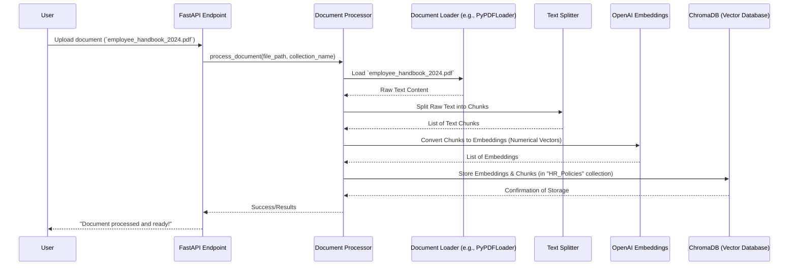

# Chapter 7: Document Processor

In our journey so far, we've explored how our chatbot gets its capabilities through **[Tools (External Capabilities)](01_tools__external_capabilities__.md)**, how each chatbot is given a unique blueprint via **[Bot Configuration (BotConfig)](02_bot_configuration__botconfig__.md)**, how its "brain" ([LangGraph Agent (Chatbot Brain)](03_langgraph_agent__chatbot_brain__.md)) processes information, and how the **[Query Router](05_query_router_.md)** intelligently picks the right tools. Most recently, we saw how the **[Memory Manager](06_memory_manager_.md)** gives our chatbots a short-term memory, allowing for natural, continuous conversations.

But what if your chatbot needs to know about information that's *not* on the internet and wasn't part of its initial training? What if you have a pile of company documents – like employee handbooks, sales reports, or product manuals – and you want your chatbot to be able to answer questions directly from *those*?

This is where the **Document Processor** comes in!

### What is the Document Processor?

Imagine you have a new, very important book (like an "Employee Handbook") that your company just published. You want your chatbot to be an expert on this book. You can't just give the chatbot the PDF file and expect it to "read" and "understand" it instantly in the same way a human would.

The **Document Processor** is like a super-efficient, digital **librarian and indexer** for your documents. Its job is to take raw documents (like PDFs, Word files, or text files) and prepare them so that your chatbot can quickly find information within them.

Here’s what this digital librarian does:

1.  **Reads Documents:** It opens and reads the content of various file types (PDFs, Word documents, plain text, Markdown).
2.  **Breaks into Chunks:** It doesn't put the *entire* book into the chatbot's brain at once. Instead, it carefully breaks down the long document into smaller, manageable pieces, like individual paragraphs or sections. These smaller pieces are called **"chunks."**
    *   **Why chunks?** Large documents are too big for the chatbot's "working memory" (its *context window*), and breaking them down allows for more precise searches. You want to find *the* paragraph about "remote work policy," not the entire 100-page handbook.
3.  **Converts to Embeddings:** This is a crucial step! The processor then takes each "chunk" of text and converts it into a special numerical format called **"embeddings."**
    *   **What are embeddings?** Think of an embedding as a unique "meaning fingerprint" for that piece of text. Text that means similar things will have "fingerprints" that are numerically "close" to each other. Computers understand numbers much better than human language, so this conversion is essential.
4.  **Stores in Vector Database:** Finally, these "meaning fingerprints" (embeddings) and their original text chunks are stored in a special kind of database called a **"vector database"** (specifically, `ChromaDB` in our project).
    *   **Why a vector database?** This database is designed to quickly find text chunks that have similar "meaning fingerprints" to a user's question. This is how the **[Document Search Tool](01_tools__external_capabilities__.md)** works: it converts your question into an embedding, then asks the vector database: "Show me the document chunks whose meaning fingerprints are closest to my question's fingerprint."

This entire process is how our `atlas-q-a-rag` system "learns" from a vast collection of your specific, internal information, making it accessible and searchable by the chatbots.

### How the Document Processor Works: Processing a New Employee Handbook

Let's say you have a new PDF file named `employee_handbook_2024.pdf` and you want your "HR Assistant" chatbot to be able to answer questions from it.

Here’s the step-by-step process of how the **Document Processor** handles this:



1.  **User Initiates:** You (or an automated system) send the `employee_handbook_2024.pdf` file to the system's `/documents/process-directory` (or `/process-document`) API endpoint, telling it which `collection_name` (e.g., "HR_Policies") to store it in.
2.  **Document Processor Takes Over:** The API passes the file and collection name to the `DocumentProcessor`.
3.  **Loading:** The `DocumentProcessor` uses a specific `Document Loader` (like `PyPDFLoader` for PDFs) to read the content of the file.
4.  **Splitting:** The extracted text is then sent to a `Text Splitter`, which breaks it down into smaller, manageable chunks.
5.  **Embedding:** Each text chunk is passed to the `OpenAIEmbeddings` model, which generates its unique "meaning fingerprint" (numerical vector).
6.  **Storing:** These embeddings, along with the original text chunks, are then stored in the `ChromaDB` vector database under the specified `HR_Policies` collection.
7.  **Ready for Search:** Once stored, the **[Document Search Tool](01_tools__external_capabilities__.md)** (which we discussed in [Chapter 1](01_tools__external_capabilities__.md)) can now query the "HR_Policies" collection in ChromaDB to find relevant information based on similarity to your questions!

### Key Components of the Document Processor (Under the Hood)

The `DocumentProcessor` class brings together several tools from `LangChain` to perform its tasks.

#### 1. Initialization and Configuration

When our `atlas-q-a-rag` application starts, the `DocumentProcessor` is initialized as a global dependency, just like the `AgenticRAG System Core`.

```python
# File: atlas-q-a-rag/app/api/dependencies.py (simplified)

from app.document_processing.document_processor import DocumentProcessor

_document_processor: DocumentProcessor = None # Global instance

def initialize_dependencies():
    """Initialize global dependencies."""
    global _document_processor # Access the global variable
    # ... AgenticRAG initialization ...

    print("Initializing DocumentProcessor...")
    _document_processor = DocumentProcessor() # Create the Document Processor instance
    print("DocumentProcessor initialized successfully")
```
**Explanation:** This snippet from `app/api/dependencies.py` shows that a single `DocumentProcessor` instance (`_document_processor`) is created when the application starts. This instance will be used whenever documents need to be processed.

Inside the `DocumentProcessor` itself, in its `__init__` method, it sets up its main tools:

```python
# File: atlas-q-a-rag/app/document_processing/document_processor.py (simplified)

from langchain_text_splitters import RecursiveCharacterTextSplitter # For chunking
from langchain_openai import OpenAIEmbeddings # For making embeddings
from pathlib import Path

class DocumentProcessor:
    def __init__(self, data_dir: str = None, embedding_model: str = None,
                 chunk_size: int = None, chunk_overlap: int = None,
                 config_file: str = "configs/document_processing.yaml"):
        # ... load configuration from YAML file ...

        self.data_dir = Path(data_dir or self.config.get("default_settings", {}).get("data_dir", "data"))
        self.embedding_model = embedding_model or self.config.get("default_settings", {}).get("embedding_model", "text-embedding-3-small")
        self.chunk_size = chunk_size or self.config.get("default_settings", {}).get("chunk_size", 1000)
        self.chunk_overlap = chunk_overlap or self.config.get("default_settings", {}).get("chunk_overlap", 200)

        # 1. Initialize the Embeddings model (our "meaning fingerprint" maker)
        self.embeddings = OpenAIEmbeddings(model=self.embedding_model)

        # 2. Initialize the Text Splitter (our "chunk" creator)
        self.text_splitter = RecursiveCharacterTextSplitter(
            chunk_size=self.chunk_size,
            chunk_overlap=self.chunk_overlap,
            length_function=len,
            separators=["\n\n", "\n", " ", ""],
        )
        # ... create directories, load metadata ...
```
**Explanation:** When a `DocumentProcessor` object is created, it reads its settings (like where to store data, which embedding model to use, and how big the text chunks should be) from a configuration file. Most importantly, it sets up:
1.  **`self.embeddings`**: This is an instance of `OpenAIEmbeddings`. This is the component that takes text and turns it into those numerical "meaning fingerprints" (embeddings).
2.  **`self.text_splitter`**: This is an instance of `RecursiveCharacterTextSplitter`. This is the component that takes a long piece of text and breaks it down into smaller `chunks`, trying to keep sentences and paragraphs together.

#### 2. Loading Documents from Different File Types (`_get_document_loader`)

The `DocumentProcessor` needs to know how to open and read different file formats. It uses specific "loaders" for this.

```python
# File: atlas-q-a-rag/app/document_processing/document_processor.py (simplified)

from langchain_community.document_loaders import PyPDFLoader, Docx2txtLoader, TextLoader

class DocumentProcessor:
    # ... __init__ and other methods ...

    SUPPORTED_EXTENSIONS = { # Dictionary mapping file extensions to their loaders
        ".pdf": PyPDFLoader,
        ".docx": Docx2txtLoader,
        ".doc": UnstructuredWordDocumentLoader, # For older .doc files
        ".txt": TextLoader,
        ".md": UnstructuredMarkdownLoader, # For Markdown files
    }

    def _get_document_loader(self, file_path: Path) -> Optional[Any]:
        """
        Get appropriate document loader for file type.
        """
        extension = file_path.suffix.lower() # Get file extension (e.g., ".pdf")
        loader_class = self.SUPPORTED_EXTENSIONS.get(extension) # Find the right loader class

        if not loader_class:
            logger.warning(f"Unsupported file type: {extension}")
            return None # Return None if we don't know how to read this file

        try:
            return loader_class(str(file_path)) # Create and return the loader object
        except Exception as e:
            logger.error(f"Error creating loader for {file_path}: {e}")
            return None
```
**Explanation:** This method is like a "file format detective." When you give it a file path, it looks at the file's extension (like `.pdf` or `.docx`). It then uses its `SUPPORTED_EXTENSIONS` map to find the correct `LangChain` loader (e.g., `PyPDFLoader` for PDFs) that knows how to extract text from that specific file type.

#### 3. Processing a Single Document (`process_document`)

This is the core method that performs the "read, chunk, embed, store" operations for one document.

```python
# File: atlas-q-a-rag/app/document_processing/document_processor.py (simplified)

from langchain_chroma import Chroma # For our vector database

class DocumentProcessor:
    # ... __init__, _get_document_loader and other methods ...

    async def process_document(
        self, file_path: str, collection_name: str, # ... other args ...
    ) -> Dict[str, Any]:
        file_path = Path(file_path)
        # ... error checking for file existence ...

        try:
            # 1. Load document content using the correct loader
            loader = self._get_document_loader(file_path)
            documents = loader.load() # This reads the file content

            # 2. Split the loaded document into smaller chunks
            chunks = self.text_splitter.split_documents(documents)

            # 3. Add useful metadata (like source file, chunk index) to each chunk
            for i, chunk in enumerate(chunks):
                chunk.metadata.update({
                    "source_file": str(file_path),
                    "file_name": file_path.name,
                    "chunk_index": i,
                    # ... more metadata ...
                })

            # 4. Initialize or connect to the Chroma vector store
            vector_store = Chroma(
                collection_name=collection_name,
                embedding_function=self.embeddings, # Tell Chroma to use our embedding maker
                persist_directory=str(self.data_dir / "chroma_stores" / collection_name),
            )

            # 5. Add the chunks (and their automatically generated embeddings) to the vector store
            vector_store.add_documents(chunks)

            # ... update processing metadata for tracking ...

            return {"success": True, "chunk_count": len(chunks), "file_path": str(file_path)}

        except Exception as e:
            # ... error handling ...
            return {"success": False, "error": str(e)}
```
**Explanation:** This method orchestrates the full pipeline for a single document:
1.  **`loader.load()`**: It uses the appropriate loader to read the file and extract its raw content.
2.  **`self.text_splitter.split_documents(documents)`**: It then takes the raw content and breaks it down into `chunks` using our configured `text_splitter`.
3.  **`chunk.metadata.update(...)`**: Important details like the original filename and the chunk's position are added to each chunk. This metadata is useful when retrieving results – you can tell the user *which* document and *which part* of the document the answer came from.
4.  **`vector_store = Chroma(...)`**: It sets up a connection to our `ChromaDB` vector database. It tells Chroma to use our `self.embeddings` component to generate the "meaning fingerprints" on the fly when new chunks are added.
5.  **`vector_store.add_documents(chunks)`**: This is the magic line where the chunks are added to the vector database. Behind the scenes, `Chroma` uses `self.embeddings` to convert each chunk into a numerical embedding and then stores both the embedding and the original text chunk.

#### 4. Processing Multiple Documents (`process_directory`)

Often, you'll want to process many documents at once. The `DocumentProcessor` also provides a convenient method for this.

```python
# File: atlas-q-a-rag/app/document_processing/document_processor.py (simplified)

class DocumentProcessor:
    # ... other methods ...

    async def process_directory(
        self, directory_path: str, collection_name: str, recursive: bool = True, # ... other args ...
    ) -> Dict[str, Any]:
        directory_path = Path(directory_path)
        # ... error checking for directory existence ...

        # Find all supported files in the directory
        supported_files = [
            f for f in directory_path.rglob("**/*") # Search recursively
            if f.is_file() and f.suffix.lower() in self.SUPPORTED_EXTENSIONS
        ]

        results = []
        successful_count = 0
        failed_count = 0

        for file_path in supported_files: # Loop through each found file
            # Call the process_document method for each file
            result = await self.process_document(str(file_path), collection_name)
            results.append(result)
            if result["success"]:
                successful_count += 1
            else:
                failed_count += 1

        return {
            "success": True,
            "total_files": len(supported_files),
            "successful_count": successful_count,
            "failed_count": failed_count,
            "results": results, # Detailed results for each file
        }
```
**Explanation:** This method is a wrapper that simply finds all supported document files (PDFs, Word files, etc.) within a specified directory (and optionally its subdirectories) and then calls the `process_document` method on each one. This makes it easy to ingest large batches of documents.

### Example Usage

You can use the `DocumentProcessor` directly via its API endpoint or through the command-line script.

**Using the CLI (Command Line Interface) script:**

To process a directory of documents into a collection named "company_docs":

```bash
python scripts/process_documents.py process-dir data/my_company_docs company_docs --recursive
```

**Explanation:** This command tells the `process_documents.py` script to:
*   `process-dir`: Process all documents in a directory.
*   `data/my_company_docs`: The directory containing your documents.
*   `company_docs`: The name of the collection in the vector database where these documents' embeddings will be stored.
*   `--recursive`: Process documents in subfolders too.

After running this, all supported documents in `data/my_company_docs` will be read, chunked, embedded, and stored in the `company_docs` collection in `ChromaDB`.

Now, when your chatbot has a **[Document Search Tool](01_tools__external_capabilities__.md)** configured to search the `company_docs` collection, it can answer questions directly from your processed documents!

### Conclusion

The **Document Processor** is the crucial link that transforms your raw, unstructured documents into a format that AI chatbots can "understand" and efficiently search. By meticulously loading, chunking, embedding, and storing your information in a vector database, it enables your `atlas-q-a-rag` system to truly "learn" from your specific knowledge base. This empowers your chatbots to provide accurate, context-aware answers directly from your private document collections, going far beyond general internet knowledge.

Now that we understand how documents are processed, our tutorial on the core components of `atlas-q-a-rag` is complete! You've learned how the system's brain works, how it gets external information, remembers conversations, and manages its knowledge.

---

Generated by [AI Codebase Knowledge Builder](https://github.com/The-Pocket/Tutorial-Codebase-Knowledge)