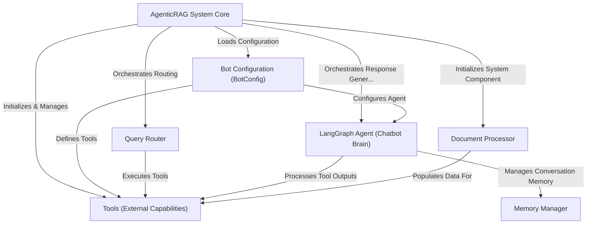

# Tutorial: atlas-q&a-rag

The `atlas-q&a-rag` project is an **Agentic RAG system** that acts as a *smart hub* for various chatbots. It allows each chatbot to have its own *personality and capabilities* by connecting them to specialized "tools" like web search, internal document search, and databases. When you ask a question, the system intelligently figures out what information is needed, *retrieves it*, and then uses a powerful AI "brain" to *generate a natural, informed answer*, all while remembering your conversation history.

**Source Repository:** [None](None)

## Chapters

1. [Tools (External Capabilities)
](01_tools__external_capabilities__.md)
2. [Bot Configuration (BotConfig)
](02_bot_configuration__botconfig__.md)
3. [LangGraph Agent (Chatbot Brain)
](03_langgraph_agent__chatbot_brain__.md)
4. [AgenticRAG System Core
](04_agenticrag_system_core_.md)
5. [Query Router
](05_query_router_.md)
6. [Memory Manager
](06_memory_manager_.md)
7. [Document Processor
](07_document_processor_.md)

---

Generated by [AI Codebase Knowledge Builder](https://github.com/The-Pocket/Tutorial-Codebase-Knowledge)